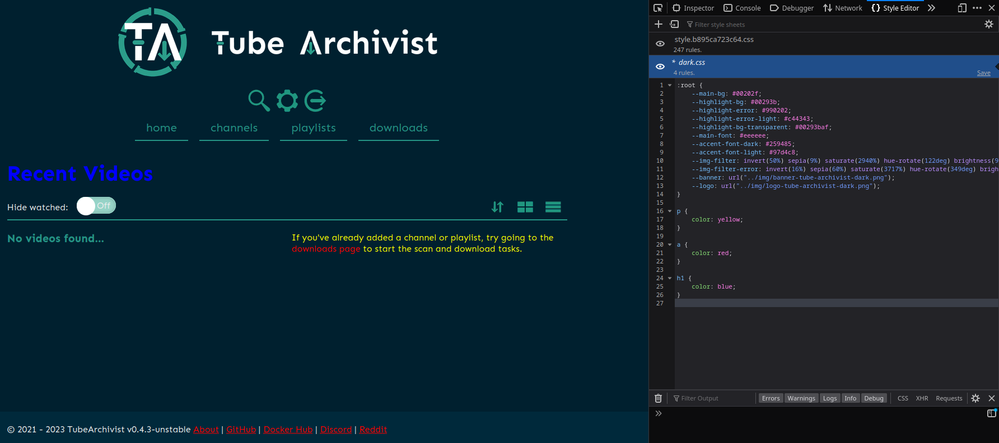

You can change the appearance of **Tube Archivist** by selecting a stylesheet in Settings under User Configurations.

## Adding Stylesheets

Assuming a default configuration, stylesheets are stored in `/app/static/css` in the `tubearchivist` container. This is where the `custom.css` stylesheet can be added and selected as `Custom` in the user settings.

The recommended method for adding new stylesheets is to mount them in the `docker-compose.yml` file. New mounts need to be added to the `tubearchivist` volume section. For example, `custom.css` is added. If `custom.css` is located in the same directory as the `docker-compose.yml` file.

???+ example
    ```yaml
    volumes:
      - media:/youtube
      - cache:/cache
      - ./test.css:/app/static/css/test.css
    ```

The container will need to be rebuilt for changes to take effect, which can be accomplished by running the command `docker compose up -d`.

## Creating Stylesheets

**Tube Archivist** applies the `style.css` stylesheet before applying the user's selected stylesheet.

You can use the default `dark.css` theme as a template to create your own. You can get it from the repo [here](https://github.com/tubearchivist/tubearchivist/blob/master/tubearchivist/static/css/dark.css).

The `:root` pseudo-class contains variables that are frequently used in `style.css` for consistent theming. However, not all changes need to be made in `:root`. Classes, IDs, and HTML tags can have their properties overridden by simply declaring new properties.

For example, the following addition to a custom stylesheet would make all `p` tags have a cursive font.

???+ example
    ```css
    p {
        font-family: cursive;
    }
    ```

To create a stylesheet, any selectable stylesheet should be used as a base. Changes can then be made as needed. Changes can be previewed easily by editing the existing stylesheet in real-time through your browser's developer tools. Below is an example of editing the `dark.css` stylesheet through Firefox's developer tools.



Note that live changes will be lost when the page is refreshed. Copy and save the changes to prevent data loss.