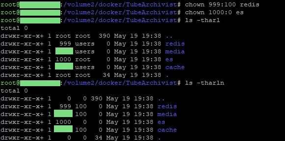
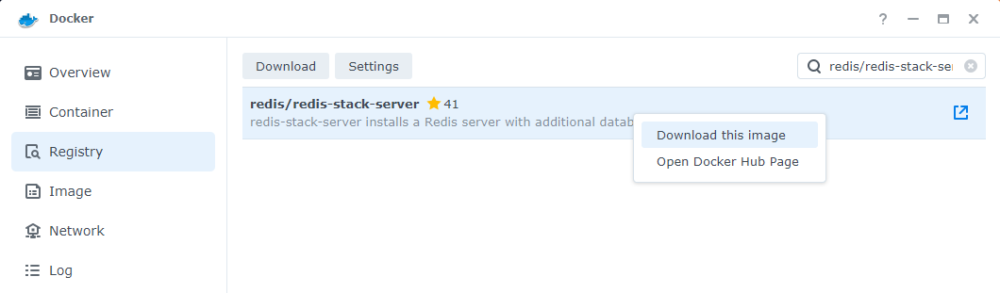

!!! note
    These are beginner's guides/installation instructions for additional platforms generously provided by users of these platforms. When in doubt, verify the details with the [project README](https://github.com/tubearchivist/tubearchivist#installing-and-updating). If you see any issues here while using these instructions, please contribute. 

There are several different methods to install TubeArchivist on Synology platforms. This will focus on the available `docker` package implementation.<!--  and `docker-compose` implementations. -->

### Prepare Directories/Folders
Before we setup TubeArchivist, we need to setup the directories/folders. You are assumed to be logged into the Synology NAS.
#### 1. Docker Base Folder
   1. Open the `File Station` utility.
   2. Click on the **Create🔽** button and choose *Create New Shared Folder*.
   3. **Name** the folder "Docker".
   4. Add a **Description**.
   5. Select the **Volume Location**. 
      > Note: By default, this will be where all data is stored. Change the folders as best meets your requirements.
   6. Select the appropriate options from the remaining checkbox configurations.

   7. Click the **Next** button.
   8. If you are going to **Encrypt** your folder, check the appropriate box and provide the Encryption Key and its confirmation.
   9. Click the **Next** button.
   10. On the **Advanced Settings** page, you can select the *Enable data checksum for advanced data integrity* setting. This may cause a performance impact, but will allow for potential file self-healing. **This cannot be changed later.**
       > Note: This is not recommended, as we will be hosting databases within this folder.
   11. If you are enabling a quota for how large the folder can get, you can select the *Enabled shared folder quota* setting and choose the maximum size this folder can grow. This can be changed later.
   12. Click the **Next** button.
   13. Confirm the settings, then click the **Apply** button. This will create the folder.
#### 2. TubeArchivist Base Folder
   1. Open the `File Station` utility.
   2. Select the "Docker" folder on the left-hand side.
   3. Click on the `Create🔽` button and choose *create Folder*.
   4. **Name** the folder "TubeArchivist".
#### 3. Redis Data
   1. Open the `File Station` utility.
   2. Select the "Docker" folder on the left-hand side.
   3. Select the "TubeArchivist" folder beneath "Docker".
   4. Click on the `Create🔽` button and choose *create Folder*.
   5. **Name** the folder "redis".
#### 4. Elastic Search Data
   1. Open the `File Station` utility.
   2. Select the "Docker" folder on the left-hand side.
   3. Select the "TubeArchivist" folder beneath "Docker".
   4. Click on the `Create🔽` button and choose *create Folder*.
   5. **Name** the folder "es".
#### 5. TubeArchivist Cache
   1. Open the `File Station` utility.
   2. Select the "Docker" folder on the left-hand side.
   3. Select the "TubeArchivist" folder beneath "Docker".
   4. Click on the `Create🔽` button and choose *create Folder*.
   5. **Name** the folder "cache".
#### 6. TubeArchivist Output
   1. Open the `File Station` utility.
   2. Select the "Docker" folder on the left-hand side.
   3. Select the "TubeArchivist" folder beneath "Docker".
   4. Click on the `Create🔽` button and choose *create Folder*.
   5. **Name** the folder "media".
#### 7. Confirm Folder Structure
Once all of the folders have been created, it should have a folder structure within Docker\TubeArchivist that includes "cache", "es", "media", and "redis" folders.

#### 8. Change Permissions - CLI Required
> If you do not have SSH access enabled for CLI, [enable it](https://kb.synology.com/en-sg/DSM/tutorial/How_to_login_to_DSM_with_root_permission_via_SSH_Telnet) before continuing.
   1. Open the SSH connection to the Synology. Login as your primary `Admin` user, or the user that was enabled for SSH access.
   2. Elevate your access to `root`. Steps are provided [here](https://kb.synology.com/en-sg/DSM/tutorial/How_to_login_to_DSM_with_root_permission_via_SSH_Telnet).
   3. Change directories to the **Volume** where the "Docker" folder resides.
       Example: `cd /volume1`
   4. Change directories to the "Docker" folder.
       Example: `cd Docker`
   5. Change directories to the "TubeArchivist" folder.
       Example: `cd TubeArchivist`
   6. Change the owner of the "redis" folder. *If correct, this does not have an output.*
       Example: `chown 999:100 redis`
   7. Change the owner of the "es" folder. *If correct, this does not have an output.*
       Example: `chown 1000:0 es`
   8. Confirm that the folders have the correct permissions.
       Example: `ls -hl`

   9. Logout from root.
       Example: `logout`
   10. Disconnect from the SSH connection.
       Example: `exit`

### Synology Docker Setup

#### 1. Install Docker

   1. Install the `Docker` Synology Package.
      1. Log in to your Synology NAS.
      2. Open the `Package Center` utility.
      3. Search for `Docker`.
      4. Click `Install`.

#### 2. Install Docker images

   2. After `Docker` is installed, open the `Docker` utility.
      3. Go to the `Registry` tab.
      4. Search for the following `images` and download them. Follow the recommended versions for each of the images.
         - `redis/redis-stack-server`
         
         - `bbilly1/tubearchivist-es`
         
         - `bbilly1/tubearchivist`
         

#### 3. Configure ElasticSearch

5. Go to the `Image` tab. From here, create an container based on each image with the associated configurations below.
  - ElasticSearch
    1. Select the associated image.
    2. Click the **Launch** button in the top.
    3. Edit the **Container Name** to be "tubearchivist-es".
    4. Click on the **Advanced Settings** button.
    5. In the **Advanced Settings** tab, check the box for `Enable auto-restart`.
    6. In the **Volume** tab, click the **Add Folder** button and select the "Docker/TubeArchivist/es" folder, then type in `/usr/share/elasticsearch/data` for the mount path.
    7. In the **Network** tab, leave the default `bridge` Network (unless you have a specific Network design that you know how to implement).
    8. In the **Port Settings** tab, replace the "Auto" entry under **Local Port** with the port that will be used to connect to ElasticSearch (default is 9200).
    9. In the **Port Settings** tab, select the entryline for port 9300 and **➖ delete** the line. It is not needed for this container.
    10. The **Links** tab does not require configuration for this container.
    11. In the **Environment** tab, add in the following ElasticSearch specific environment variables that may apply.
        - `discovery.type=single-node`
        - `ES_JAVA_OPTS=-Xms512m -Xmx512m`
        - `UID=1000`
        - `GID=0`
        - `xpack.security.enabled=true`
        - `ELASTIC_PASSWORD=verysecret` 
        - `path.repo=/usr/share/elasticsearch/data/snapshot`
          > !!! note "BE AWARE"
                - Do not use the default password as it is very insecure.
                - Activating snapshots for backups should only be done *after* setting the `path.repo` setting.
        
    12. Click on the **Apply** button.
    13. Back on the **Create Container** screen, click the **Next** button.
    14. Review the settings to confirm, then click the **Apply** button.

#### 4. Configure Redis

   1. Select the associated image.
   2. Click the **Launch** button in the top.
   3. Edit the **Container Name** to be "tubearchivist-redis".
   4. Click on the **Advanced Settings** button.
   5. In the **Advanced Settings** tab, check the box for `Enable auto-restart`.
   6. In the **Volume** tab, click the **Add Folder** button and select the "Docker/TubeArchivist/redis" folder, then type in `/data` for the mount path.
   7. In the **Network** tab, leave the default `bridge` Network (unless you have a specific Network design that you know how to implement).
   8. In the **Port Settings** tab, replace the "Auto" entry under **Local Port** with the port that will be used to connect to Redis (default is 6379).
   9. In the **Links** tab, select the "tubearchivist-es" container from the **Container Name** dropdown and provide it the same alias, "tubearchivist-es".
   10. In the **Environment** tab, add in any Redis specific environment variables that may apply (none by default).
   11. Click on the **Apply** button.
   12. Back on the **Create Container** screen, click the **Next** button.
   13. Review the settings to confirm, then click the **Apply** button.

#### 5. Configure TubeArchivist

   1. Select the associated image.
   2. Click the **Launch** button in the top.
   3. Edit the **Container Name** to be "tubearchivist".
   4. Click on the **Advanced Settings** button.
   5. In the **Advanced Settings** tab, check the box for `Enable auto-restart`.
   6. In the **Volume** tab, click the **Add Folder** button and select the "Docker/TubeArchivist/cache" folder, then type in `/cache` for the mount path.
   7. In the **Volume** tab, click the **Add Folder** button and select the "Docker/TubeArchivist/media" folder, then type in `/youtube` for the mount path.
   8. In the **Network** tab, leave the default `bridge` Network (unless you have a specific Network design that you know how to implement).
   9. In the **Port Settings** tab, replace the "Auto" entry under **Local Port** with the port that will be used to connect to TubeArchivist (default is 8000).
   10. In the **Links** tab, select the "tubearchivist-es" container from the **Container Name** dropdown and provide it the same alias, "tubearchivist-es".
   11. In the **Links** tab, select the "tubearchivist-redis" container from the **Container Name** dropdown and provide it the same alias, "tubearchivist-redis".
   12. In the **Environment** tab, add in the following TubeArchivist specific environment variables that may apply. **Change the variables as is appropriate to your use case. Follow the [README section](https://github.com/tubearchivist/tubearchivist#tube-archivist) for details on what to set each variable.**
      - `TA_HOST=synology.local`
      - `ES_URL=http://tubearchivist-es:9200`
      - `REDIS_HOST=tubearchivist-redis`
      - `HOST_UID=1000`
      - `HOST_GID=0`
      - `TA_USERNAME=tubearchivist`
      - `TA_PASSWORD=verysecret`
      - `ELASTIC_PASSWORD=verysecret`
      - `TZ=America/New_York`
      > !!! note "BE AWARE"
            - Do not use the default password as it is very insecure.
            - Ensure that ELASTIC_PASSWORD matches the password used on the tubearchivist-es container.
      
   13. Click on the **Apply** button.
   14. Back on the **Create Container** screen, click the **Next** button.
   15. Review the settings to confirm, then click the **Apply** button.
6. After the containers have been configured and started, you can go to the **Container** tab and monitor the containers.
7. To review the logs to ensure that the system has started successfully, select the "tubearchivist" container and click on the **Details** button. In the new window, go to the **Log** tab. Monitor the logs until either an error occurs or the message `celery@tubearchivist ready.` is in the logs. This may take a few minutes, especially for a first time setup.
   > !!! note
         Synology Docker presents the logs in a pagination format. If you are not seeing the logs update, check if there are additional pages.
8. After it has started, go to the location in the `TA_HOST`. This should give you the standard TubeArchivist login screen.
<!-- 
### Docker-Compose Setup -->
<!-- This section is a Work In Progress -->

**From there, you should be able to start up your containers and you're good to go!**

### Synology Docker Upgrade

If you're still having trouble, join us on [discord](https://www.tubearchivist.com/discord) and come to the #support channel.