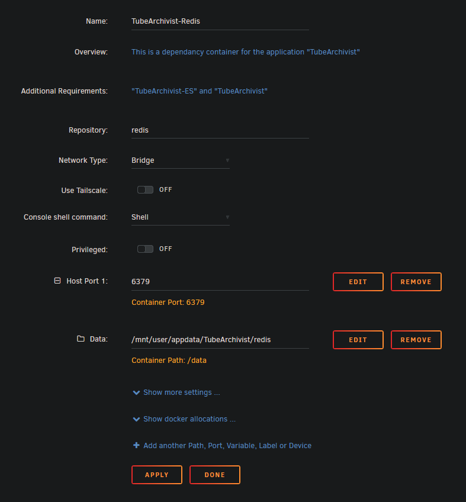
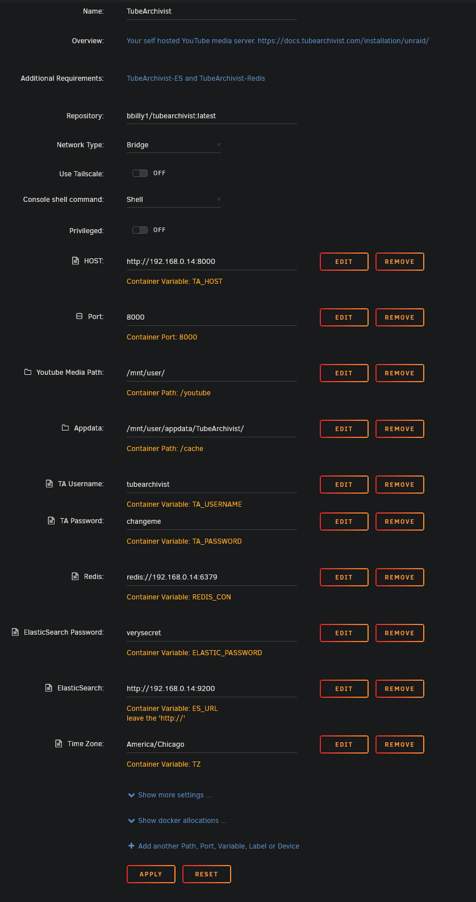

!!! abstract
    These are beginner's guides/installation instructions for additional platforms generously provided by users of these platforms. When in doubt, verify the details with the [project README](https://github.com/tubearchivist/tubearchivist#installing). If you see any issues here while using these instructions, please contribute. 

**Tube Archivist**, and all if it's dependencies, are located in the [community applications](https://unraid.net/community/apps?q=tubearchivist) store. The three containers you will need are as follows:

-   **TubeArchivist-RedisJSON**: Redis functions as a cache and temporary link between the application and the file system. Redis is used to store and display messages and configuration variables.
-   **TubeArchivist-ES**: Elasticsearch stores the video metadata and enables searchable functionality for all fields. Elasticsearch is also used to keep track of the download queue.
-   **TubeArchivist**: Once your YouTube video collection grows, it becomes hard to search and find a specific video. That's where **Tube Archivist** comes in: By indexing your video collection with metadata from YouTube, you can organize, search and enjoy your archived YouTube videos without hassle, and offline, through a convenient web interface.

## Installing Tube Archivist Applications

### Install  `TubeArchivist-RedisJSON`


This is the easiest container to setup of the three, just make sure that you do not have any port conflicts and `/data` is mounted to the correct path. The other containers will map to the same root directory (/mnt/user/appdata/TubeArchivist).

If you need to install `TubeArchivist-RedisJSON` on a different port, you'll have to follow [these steps](docker-compose.md#redis-on-a-custom-port) later on when installing the `TubeArchivist` container.
If you're running into port collision errors, recreate the steps outline in the [docker compose installation instructions.](docker-compose.md/#redis-on-a-custom-port)

!!! tip
    Make sure and start the Redis and ElasticSearch containers approximately one minute before starting `TubeArchivist`


### Install  `TubeArchivist-ES`

ElasticSeach is also pretty easy to setup. Again, make sure you have no port conflicts, that you mapped the ElasticSearch Data directory to the same root directory as `RedisJSON` (/mnt/user/appdata/TubeArchivist), and make sure to change the default password to something more secure. 

There are four additional settings in the "show more settings" area, but they don't usually require any changes.

!!! tip
    Make sure and start Redis and the ElasticSearch containers approximately one minute before starting `TubeArchivist`

### Install  `TubeArchivist`



It's finally time to set up TubeArchivist!

 - `HOST:` This is a list of IP addresses that you will host TA from. Example, 192.168.0.14 is the IP address of my Unraid server. If I was going to access TA from a VPN, or domain name, I'd put those next to my host IP with a space separating the different addresses. More information [here.](https://github.com/tubearchivist/tubearchivist#installing-and-updating)


 - `Port:` Again, make sure that you have no port conflicts on 8000.
   
 - `Youtube Media Path:` is where you'll download all of your videos to.
   Make sure that this is an empty directory to not cause confusion when
   starting the application. If you have existing videos that you'd like
   to import into Tube Archivist, please checkout the [settings
   wiki.](https://github.com/tubearchivist/tubearchivist/wiki/Settings#manual-media-files-import)
   
- `Appdata:` This should be the same base path as the other two containers (/mnt/user/appdata/TubeArchivist).
   
 - `TA Username:` This will be your username for TubeArchivist.
   
 - `TA Password:` This will be your password for TubeArchivist.
   
 - `Redis:` This will **ONLY** be the ip address of your Redis container.
  - If you want to host Redis on a differnt port than the default 6379, simply add a new variable as show below.
    

 - `ElasticSearch Password:` This is the password you defined in the `TubeArchivist-ES` container.
 - `ElasticSearch:` This seems to cause some confusion, but it's a pretty simple step, just replace the IP and Port to match your `TubeArchivist-ES` container.

 (example: if your IP is 192.168.0.14, the value should be http://192.168.0.14:9200)

 - `Time Zone:` This is an important step for your scheduler. To find your timezone, use a site like [TimeZoneConverter](http://www.timezoneconverter.com/cgi-bin/findzone.tzc) 

**From there, you should be able to start up your containers and you're good to go!**

## Troubleshooting

### Permissions Errors

If you run into permission errors, try ```'newperms /mnt/user/appdata/TubeArchivist/'``` to reset the permissions to the root of your TubeArchivist appdata folder.

### Support

If you're still having trouble, join us on [discord](https://www.tubearchivist.com/discord) and come to the [#support channel.](https://discord.com/channels/920056098122248193/1006394050217246772)

